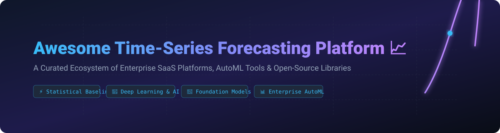

# 📈 Awesome Time-Series Forecasting Platform

  

     

---

## 💡 Overview & Ecosystem Insights

Welcome to the **Awesome Time-Series Forecasting Platform** index! This repository tracks top commercial **SaaS time-series forecasting platforms**, **enterprise AutoML solutions**, and **open-source Python/PyTorch libraries** designed to predict future trends, analyze seasonal patterns, and detect anomalies in temporal data.

Whether you are a demand planner, quantitative analyst, or machine learning engineer, this curated guide covers everything from fast statistical baselines (`ARIMA`, `ETS`) and deep learning models (`N-BEATS`, `TFT`) to zero-shot time-series foundation models (`TimeGPT`, `Chronos`, `Moirai`).

---

## 📑 Table of Contents

- [📊 SaaS & Hosted Platforms](#-saas--hosted-platforms)
- [🔓 Open-Source GitHub Projects](#-open-source-github-projects)
- [🤝 How to Contribute](#-how-to-contribute)
- [⚖️ Disclaimer](#-disclaimer)
- [💖 Support & Community](#-support--community)
- [🌟 Star History](#-star-history)

---

## 📊 SaaS & Hosted Platforms

💡 **Market Overview**: The global time-series forecasting & analytics market is estimated at **$4.8 Billion (2026)** with a CAGR of 16.5%. The market is **moderately fragmented**, balancing hyper-scale cloud providers (AWS, Google Cloud, Azure) with enterprise AutoML platforms (DataRobot, Dataiku, H2O.ai) and specialized AI forecasting vendors (Anodot, Pecan AI, Nixtla).

Below is a tabular comparison of leading commercial SaaS platforms sorted by company scale/valuation (descending):

| 🏢 Platform | 📝 Key Capabilities & Best For | 💵 Starting Price | 🎁 Free Tier / Trial Limit | 📐 Company Size / Valuation |
| :--- | :--- | :--- | :--- | :--- |
| **[Amazon Forecast](https://aws.amazon.com/forecast/)** ☁️ | **AWS Managed Demand Planning** — Uses DeepAR+ & CNN-QR for supply chain & demand prediction. *(Note: Discontinued for new signups).* | $0.0001 per forecast value + $0.05/training hr | 2-Month Free Tier: 10k forecast values/mo & 10 GB storage | ~$2.2T Valuation (~$600B Annual Rev) |
| **[Google Cloud Vertex AI Forecasting](https://cloud.google.com/vertex-ai)** 🌐 | **AutoML Temporal Aggregation** — Supports hierarchical time-series models, BigQuery ML integration, & automated feature derivation. | $0.20 per compute node-hr for tabular model training | $300 Free Credits valid for 90 days across GCP | ~$3.4T Valuation (~$350B Annual Rev) |
| **[Azure Automated ML Forecasting](https://azure.microsoft.com/en-us/products/machine-learning/)** 💻 | **Enterprise AutoML Forecasting** — Automated lag feature generation, holiday calendars, and rolling window cross-validation. | $0.12 per compute-hour (Standard D2 v3 node) | $200 Free Credit for 30 days + 12 Months free services | ~$3.1T Valuation (~$245B Annual Rev) |
| **[Dataiku DSS](https://www.dataiku.com/)** 🔮 | **Collaborative Data Science Platform** — Visual time-series forecasting, statistical baseline comparison, & production pipelines. | $1,480 / month (Dataiku Launch Tier) | Free Edition for 3 users (50,000 rows processing cap) | ~$3.7B Valuation (~$250M ARR) |
| **[DataRobot Time Series](https://www.datarobot.com/)** 🤖 | **Automated Multi-Series ML** — High-scale enterprise forecasting with governed AutoML, backtesting, and automated feature engineering. | $250 / month (DataRobot Starter Plan) | 14-Day Free Trial (500 MB dataset limit, 10 workers) | ~$3.0B Valuation (~$300M ARR) |
| **[H2O Driverless AI](https://h2o.ai/)** 🧠 | **GPU-Accelerated AutoML** — Automatic time-series feature derivation, causality detection, and interpretability for predictive models. | $300 / month per user (H2O AI Cloud Starter) | 14-Day Free Trial (16 vCPU / 64 GB RAM Cloud instance) | ~$1.7B Valuation (~$100M ARR) |
| **[Anodot](https://www.anodot.com/)** 🚨 | **Autonomous Metric Monitoring** — Real-time AI anomaly detection, revenue forecasting, and cloud cost optimization alerts. | $500 / month (Starter SaaS Monitoring Tier) | 14-Day Free Trial (up to 1,000 active metrics) | ~$250M Valuation (~$35M ARR) |
| **[Pecan AI](https://www.pecan.ai/)** 🎯 | **Predictive Analytics for Business** — CRM-integrated automated demand forecasting, churn modeling, & customer LTV prediction. | $950 / month (Pecan Starter Predictive Plan) | 14-Day Free Trial (Full feature access with sample data) | ~$150M Valuation (~$20M ARR) |
| **[Nixtla TimeGPT](https://www.nixtla.io/)** ⚡ | **Generative Time-Series Foundation Model** — Zero-shot inference, multivariate transformer forecasting via hosted API or private cloud. | $0.001 per 1,000 input/output tokens | Free Tier: 10,000 free tokens / month upon API registration | ~$50M Valuation (Series A / Nixtla Inc.) |
| **[Tangent Works](https://www.tangent.works/)** ⏱️ | **Instant Machine Learning (TIM)** | Instant model building for industrial IoT, energy forecasting, and real-time operational analytics. | $490 / month (TIM Cloud Starter Plan) | 30-Day Free Trial (100 model estimations / month limit) | ~$20M Valuation (~$5M ARR) |

---

## 🔓 Open-Source GitHub Projects

The open-source time-series ecosystem provides powerful Python frameworks ranging from classical statistical methods to GPU-accelerated deep neural networks and pretrained foundation models.

Below is the list of top open-source time-series repositories, sorted by **GitHub Star Count** (descending):

1. 🌟 **[Prophet (Meta)](https://github.com/facebook/prophet)**   
   **The standard for business time-series forecasting** (MIT Licensed). Decomposable additive model fitting non-linear trends with daily, weekly, and yearly seasonality plus holiday effects.

2. 🌟 **[Time-Series-Library (THU ML Group)](https://github.com/thuml/Time-Series-Library)**   
   **A unified library for deep learning time-series models** (MIT Licensed). Implements benchmark deep neural networks including Autoformer, Informer, FEDformer, TimesNet, and PatchTST.

3. 🌟 **[sktime](https://github.com/sktime/sktime)**   
   **Unified framework for time-series machine learning** (BSD-3-Clause). Dedicated interfaces for forecasting, classification, regression, clustering, and anomaly detection with scikit-learn compatibility.

4. 🌟 **[PyCaret](https://github.com/pycaret/pycaret)**   
   **Low-code machine learning in Python** (MIT Licensed). Features a modular time-series forecasting module supporting automated model comparison, hyperparameter tuning, and ensembling.

5. 🌟 **[Darts (Unit8)](https://github.com/unit8co/darts)**   
   **User-friendly time-series forecasting & backtesting** (Apache-2.0). Seamlessly unifies classical models (ARIMA, Exponential Smoothing) with deep learning architectures (N-BEATS, TFT, LightGBM).

6. 🌟 **[tsfresh](https://github.com/blue-yonder/tsfresh)**   
   **Automatic feature extraction for time series** (MIT Licensed). Calculates hundreds of statistical characteristics and features for time-series classification and regression pipelines.

7. 🌟 **[Kats (Meta)](https://github.com/facebookresearch/kats)**   
   **One-stop shop for time-series analysis** (MIT Licensed). Developed by Meta's Infrastructure Data Science team for forecasting, outlier detection, feature extraction, and time-series simulations.

8. 🌟 **[Chronos (Amazon Science)](https://github.com/amazon-science/chronos-forecasting)**   
   **Pretrained pretrained language model architectures for zero-shot forecasting** (Apache-2.0). Converts time series data into token sequences to provide probabilistic forecasts out of the box.

9. 🌟 **[GluonTS (AWS)](https://github.com/awslabs/gluonts)**   
   **Probabilistic time-series modeling in Python** (Apache-2.0). Built on PyTorch and MXNet; powers Amazon Forecast algorithms with state-of-the-art probabilistic neural architectures.

10. 🌟 **[PyTorch Forecasting](https://github.com/jdb78/pytorch-forecasting)**   
    **Neural forecasting built on PyTorch Lightning** (MIT Licensed). Provides advanced deep learning architectures such as Temporal Fusion Transformer (TFT), N-BEATS, and DeepAR with rich visualization.

11. 🌟 **[StatsForecast (Nixtla)](https://github.com/Nixtla/statsforecast)**   
    **Blazing fast statistical forecasting at scale** (Apache-2.0). High-performance C++/Numba optimized implementations of AutoARIMA, AutoETS, CES, and Theta that scale to millions of series.

12. 🌟 **[Merlion (Salesforce)](https://github.com/salesforce/Merlion)**   
    **Time-series intelligence framework** (BSD-3-Clause). Provides end-to-end benchmarking and model ensembling for time-series forecasting, anomaly detection, and automated alerting.

13. 🌟 **[NeuralForecast (Nixtla)](https://github.com/Nixtla/neuralforecast)**   
    **Deep neural network library for time-series** (Apache-2.0). Complete suite of PyTorch neural models including N-HiTS, PatchTST, NHITS, and AutoFormer for multi-horizon forecasting.

14. 🌟 **[Orbit (Uber)](https://github.com/uber/orbit)**   
    **Bayesian time-series forecasting with PyStan & Pyro** (Apache-2.0). Flexible Bayesian structural time-series model (DLM, KGLM) for marketing mix modeling and demand forecasting.

15. 🌟 **[pmdarima](https://github.com/alkaline-ml/pmdarima)**   
    **Python statistical ARIMA modeling toolkit** (MIT Licensed). Scikit-learn compliant wrapper around R's auto.arima function for automatic seasonal order selection and differencing tests.

16. 🌟 **[Moirai / uni2ts (Salesforce AI Research)](https://github.com/SalesforceAIResearch/uni2ts)**   
    **Universal time-series foundation model library** (Apache-2.0). Masked encoder architecture pretrained on LOTSA dataset for zero-shot probabilistic forecasting across arbitrary frequencies.

17. 🌟 **[Lag-Llama](https://github.com/time-series-foundation-models/lag-llama)**   
    **Foundation model for univariate probabilistic forecasting** (Apache-2.0). Decoder-only Transformer model based on Llama architecture using lag features for zero-shot prediction.

18. 🌟 **[arch](https://github.com/bashtage/arch)**   
    **Financial econometrics & volatility forecasting in Python** (RISC-1). Implements GARCH, EGARCH, TARCH, and unit root testing for financial asset pricing and volatility modeling.

19. 🌟 **[AutoTS](https://github.com/winedarksea/AutoTS)**   
    **Automated time-series forecasting library** (MIT Licensed). Uses genetic algorithms to discover optimal pre-processing, ensembling, and model configurations automatically.

20. 🌟 **[MLForecast (Nixtla)](https://github.com/Nixtla/mlforecast)**   
    **Machine learning forecasting pipelines** (Apache-2.0). Scalable feature engineering for tree-based models (LightGBM, XGBoost, CatBoost) with high performance on large datasets.

21. 🌟 **[Granite TSFM (IBM)](https://github.com/ibm-granite/granite-tsfm)**   
    **IBM Granite time-series foundation models** (Apache-2.0). Open-source foundation model wrappers providing uniform APIs for zero-shot forecasting, fine-tuning, and classification.

22. 🌟 **[Omnicast](https://github.com/afraz496/omnicast)**   
    **Interval-aware automatic statistical forecasting** (Open Source). Provides clean interval estimation, backtesting, and automated model selection across statistical and LSTM backends.

---

## 🤝 How to Contribute

Contributions to expand and update this ecosystem guide are warmly welcomed!

1. 🍴 **Fork this repository**.
2. 📝 **Add or update an entry** in `README.md` following the tabular or open-source list format.
3. 🔗 **Ensure accurate links** and concise, factual descriptions.
4. 🚀 **Submit a Pull Request** with a summary of changes.

---

## ⚖️ Disclaimer

- This list is **community-curated** for educational and research reference.
- Commercial cloud forecasting services operate under vendor privacy policies. Enterprise datasets containing PII or financial metrics should be reviewed before cloud deployment.
- **Amazon Forecast Deprecation Note**: Amazon Forecast is no longer accepting new customer accounts; active workloads continue to be supported by AWS.
- **Accuracy Dependencies**: Forecasting model quality relies heavily on data cleaning, stationarity, handling missing values, and calendar feature engineering.

---

## 💖 Support & Community

Thank you for exploring this curated time-series forecasting ecosystem! If you find this repository helpful for your projects, research, or demand planning workflows:

- 🌟 **Star this repository** to stay updated with new forecasting tools and foundation models.
- 🔀 **Fork it** to maintain your custom collection or contribute new tools.
- 📢 **Share it** with fellow data scientists, ML engineers, and demand planners.
- ☕ **Support the maintainer**: If you'd like to support ongoing updates and open-source maintenance, consider [Sponsoring on GitHub](https://github.com/sponsors/ishandutta2007).

---

## 🌟 Star History

---

  <b>Made with ❤️ for data scientists, demand planners, and quantitative researchers worldwide.</b>

